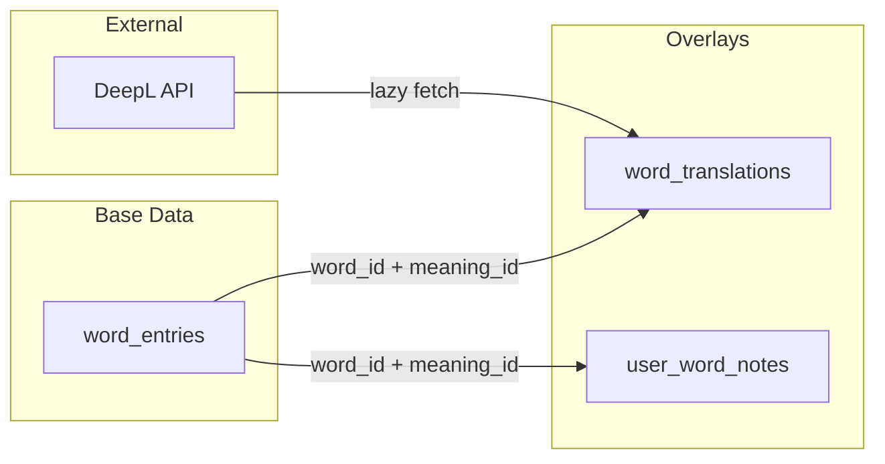

# Word Overlays Storage Plan

## Архитектура



## 1. Схема базы данных

### Таблица `word_translations` (общие переводы)

Хранит переведённый JSON для каждого meaning на каждый язык:

```sql
create table word_translations (
    id uuid primary key default gen_random_uuid(),
    word_id uuid not null references word_entries(id) on delete cascade,
    meaning_id int not null,           -- соответствует meaning_id из карточки
    target_lang text not null,         -- 'ru', 'en', 'uk', etc.
    translated_content jsonb not null, -- полный переведённый meaning
    source text default 'deepl',       -- источник перевода
    created_at timestamptz default now(),
    
    unique(word_id, meaning_id, target_lang)
);

create index word_translations_lookup_idx 
    on word_translations(word_id, target_lang);
```

Пример `translated_content` для meaning_id=1, target_lang='ru':

```json
{
  "definition": "определять; решать",
  "context": "кто-то что-то решает",
  "examples": [
    "на моей работе руководство определяет размер зарплаты",
    "неважно, сколько людей придет"
  ],
  "idioms": [
    { "expression": "неважно", "explanation": "это не имеет значения" }
  ]
}
```

### Таблица `user_word_notes` (личные заметки)

```sql
create table user_word_notes (
    id uuid primary key default gen_random_uuid(),
    user_id uuid not null references auth.users(id) on delete cascade,
    word_id uuid not null references word_entries(id) on delete cascade,
    meaning_id int,                    -- null = заметка ко всему слову
    notes text not null,
    created_at timestamptz default now(),
    updated_at timestamptz default now(),
    
    unique(user_id, word_id, meaning_id)
);

create index user_word_notes_user_word_idx 
    on user_word_notes(user_id, word_id);
```

### Настройка языка перевода в `user_settings`

Добавить колонку для предпочитаемого языка перевода:

```sql
alter table user_settings
    add column if not exists translation_lang text default null;
    -- null = переводы отключены, 'ru'/'en'/etc. = выбранный язык
```

## 2. Миграция

Создать файл `db/migrations/0032_word_overlays.sql` с:

- Создание таблицы `word_translations`
- Создание таблицы `user_word_notes`
- Добавление `translation_lang` в `user_settings`
- Индексы для быстрого поиска

## 3. RPC функции (Supabase Edge Functions / SQL)

### `get_word_translation(word_id, meaning_id, target_lang)`

Возвращает перевод из БД (или null если нет). UI вызывает эту функцию, и если null — запускает DeepL через API route.

### `upsert_word_translation(word_id, meaning_id, target_lang, content)`

Сохраняет перевод после получения от DeepL. Вызывается из API route.

### `get_user_notes(user_id, word_id)`

Возвращает все заметки пользователя для слова (все meaning_id).

### `upsert_user_note(user_id, word_id, meaning_id, notes)`

Создаёт или обновляет заметку.

### `delete_user_note(user_id, word_id, meaning_id)`

Удаляет заметку.

## 4. API route для DeepL

Создать `apps/api/routes/translate.ts` (или Next.js API route):

- Принимает `word_id`, `meaning_id`, `target_lang`
- Проверяет наличие в БД
- Если нет — извлекает meaning из карточки, отправляет в DeepL
- Сохраняет результат в `word_translations`
- Возвращает перевод

## 5. TypeScript типы

Добавить в [`apps/ui/lib/types.ts`](apps/ui/lib/types.ts):

```typescript
export type TranslatedMeaning = {
  definition?: string;
  context?: string;
  examples?: string[];
  idioms?: Array<{ expression: string; explanation: string }>;
};

export type WordTranslation = {
  wordId: string;
  meaningId: number;
  targetLang: string;
  content: TranslatedMeaning;
};

export type UserWordNote = {
  id: string;
  wordId: string;
  meaningId: number | null;
  notes: string;
  createdAt: string;
  updatedAt: string;
};
```

## 6. UI интеграция (будущее)

- Иконка перевода рядом с каждым текстовым полем
- При наведении/клике — показ tooltip с переводом
- Секция "Мои заметки" под карточкой с редактором

## Порядок реализации

1. Миграция БД (таблицы + индексы)
2. RPC функции для чтения/записи
3. TypeScript типы
4. API route для DeepL (когда будет готов ключ)
5. UI компоненты