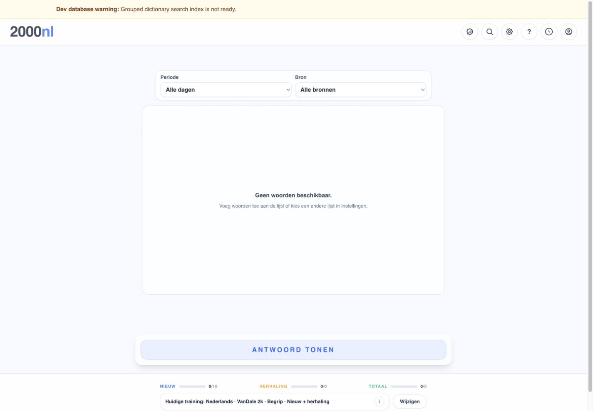
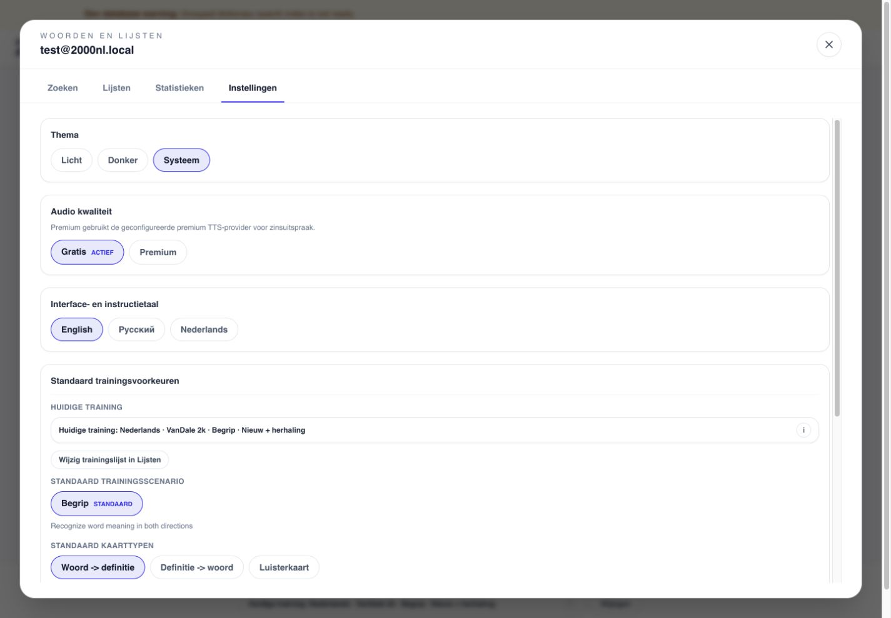
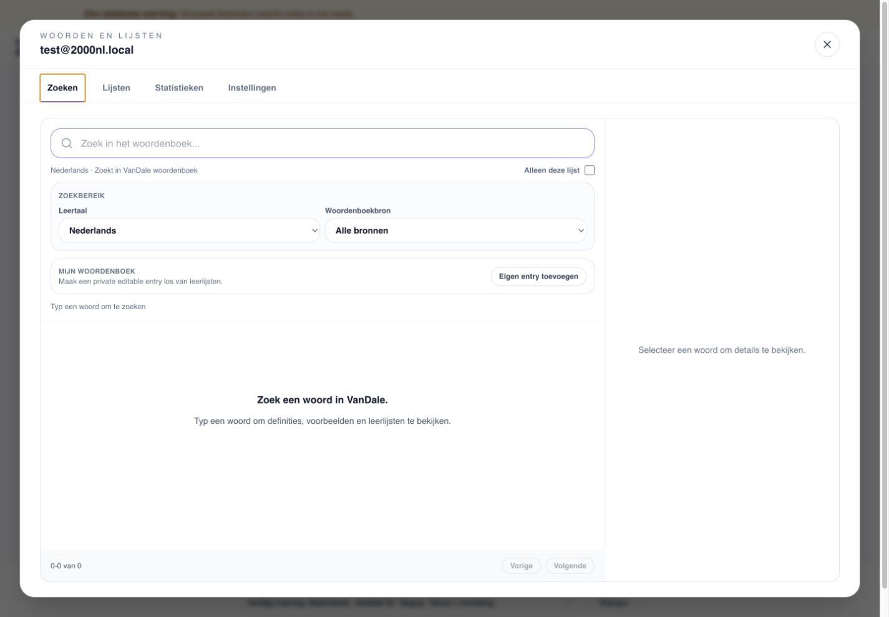
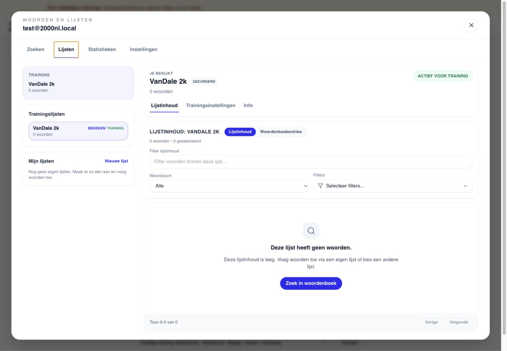
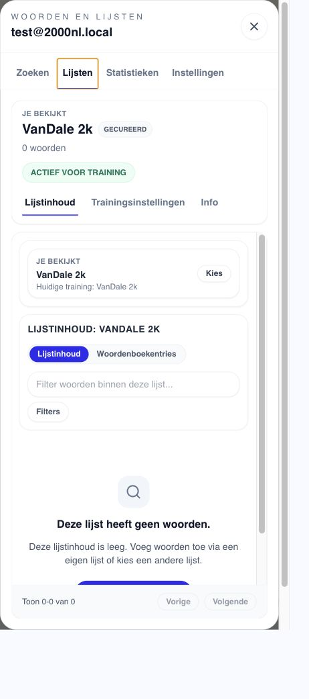
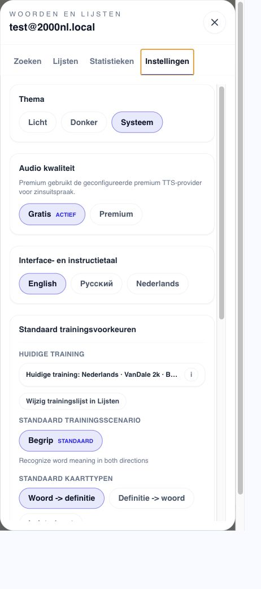
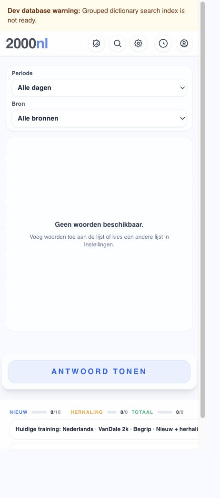

# Settings And Training Current-Flow Evidence

Status: Wave 0 desktop/mobile characterization
Captured: 2026-07-24

## Scope

This package records the current authenticated Training and `SettingsModal`
experience before navigation extraction. It covers the empty local-data state,
the four modal areas, responsive layout, and the current session-lifetime seam.

Capture environment (operator-observed and recorded in
[`capture-metadata.json`](capture-metadata.json)):

- local 2000NL UI at revision `5e97c239` plus this evidence change;
- local Supabase contracts applied and probed;
- desktop viewport `1440 × 1000`;
- mobile viewport `390 × 844`;
- dev-only same-origin test login.

Privacy review (2026-07-30): all seven screenshots were inspected before their
public-repository recovery. They contain no personal account or user-created
data. Where an account is visible, it is the deliberate local-only synthetic
identity `test@2000nl.local`; the lists shown are empty system fixtures.
Screenshot checksums match `capture-metadata.json`.

The local database had no dictionary entries or search-index documents. The
health endpoint therefore reported `database.target: local` and a warning that
the grouped search index was not ready. Empty content and that warning are
environment limits, not product defects. Layout, task entry, hierarchy,
semantics, and empty-state behavior remain valid evidence.

## Flow Steps

### 1. Desktop Training entry — limited

The Training shell is clear and the current scope is visible in the footer.
The empty state points toward Settings even though the actual recovery task
could be list selection, dictionary search, or adding words.

### 2. Desktop Settings — structurally healthy, conceptually overloaded

The surface is readable and the effective Training scope is repeated. It mixes
application preferences, subscription-derived audio behavior, interface
language, translation defaults, and live Training controls without a
draft/apply boundary.

### 3. Desktop Search — healthy layout, mixed ownership

Search has a useful master/detail layout and separates lookup scope from
Training scope. It also contains private-entry creation, list filtering, list
membership navigation, and a path back into Training, so it is already closer
to a Library destination than an application setting.

### 4. Desktop Lists — usable but dense

The viewed list and active Training list are visibly distinct, which must be
preserved. List navigation, list management, content mode, filters, training
activation, and list-specific setup compete within one overlay.

### 5. Mobile Lists — at risk

The desktop sidebar becomes a selector card successfully, but the overlay
shows nested vertical scrollbars, a right-side gutter, and a partially clipped
empty-state action near the bottom. The user has several simultaneous
navigation layers: top tabs, viewed-list selector, list sub-tabs, and content
mode.

### 6. Mobile Settings — at risk

The tab row is horizontally clipped (`Zoeken` and `Statistieken` lose visible
characters), while the overlay and inner content each expose their own scroll
track. The effective Training summary truncates before the user can distinguish
all active values.

### 7. Mobile Training entry — limited

The card, answer action, and progress summary form a readable vertical flow.
The long effective-scope summary is clipped at the right edge, and the empty
state still sends the user to the undifferentiated Settings container.

## Highest-Impact Findings

1. **The container has no single information-architecture identity.**
   `Woorden en lijsten` contains Library search, list management, Statistics,
   App Settings, and Training Setup. Each should become a shell destination or
   a clearly nested area, not remain four equivalent settings tabs.
2. **Mobile navigation and scrolling are structurally overloaded.** Nested
   scroll containers, a clipped top tab row, and multiple local subnavigation
   layers make orientation and focus return fragile.
3. **Training defaults and the live session are visually conflated.** Several
   controls apply immediately and can reset/reload the running session, while
   surrounding copy calls them defaults for future sessions.
4. **The empty-state recovery path is underspecified.** “Choose another list
   in Settings” hides whether the user should open Library, activate a list, or
   add a dictionary entry.
5. **Dictionary source is still modeled as a special list.** The UI can
   visually separate source, viewed list, and training list only partially
   while the underlying source is filtered by list name.

## Accessibility Risks

- The overlay is not exposed as a `dialog` with `aria-modal`; the underlying
  Training banner, main content, and footer remain in the accessibility tree
  while it is open.
- The four primary tabs are ordinary buttons without `tablist`/`tab` semantics
  or an exposed selected state.
- Screenshot evidence shows multiple scroll containers on mobile; keyboard and
  screen-reader focus order through those containers still needs an
  interaction test.
- The icon-only close button has an accessible name, and major form controls
  have useful labels. These are confirmed strengths.
- Screenshots cannot prove contrast ratios, screen-reader announcements,
  complete keyboard traversal, zoom reflow, or focus return.

## Session Characterization

`TrainingScreen` remains mounted behind the overlay. Focused tests confirm that
the current card and revealed-answer state survive tab changes and closing the
modal, and that modal navigation does not fetch another Training card.

Changing a session-defining value remains a separate explicit reset boundary.
Refresh, tab close, and leaving the app still end the transient session as
specified by proposed ADR 0004.

## Related Decision Material

- `docs/architecture/settings-modal-entrypoint-task-map.md`
- `docs/adr/0004-training-session-lifetime-during-navigation.md`
- shared coordination repository:
  `/Users/khrustal/dev/docs/intent/2000nl-audiofilms-dictionary-ux-architecture-plan-v2.md`
