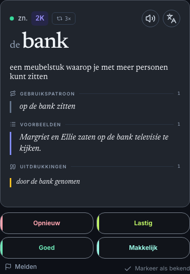
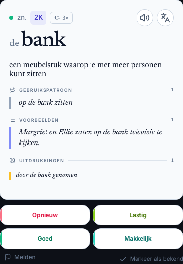

# Answer: first measured implementation pass

Owner: [#251](https://github.com/vbalashi/2000nl/issues/251). Date: 2026-09-06.
Scope approved by the owner after the measurement sheet in
[PR #257](https://github.com/vbalashi/2000nl/pull/257): M2, M3, M6 only.
Source: Pen 30.95.08 / `twUIm`, resolved nodes recorded in PR #257.

| Measurement | Before | Implemented and browser-checked |
| --- | --- | --- |
| Answer metadata/action row → headword block (M2) | 0 px | 8 px |
| Normal-length Answer headword / article (M3) | 48 / 24 px | 44 / 20 px |
| Primary example size / line height (M6) | 13 / 18.2 px | 16 / 22.4 px |

The shared headword component has explicit `training-face` and
`training-answer` variants. There is no alternate renderer or compatibility
branch. Face remains 48/24 px; Library defaults and the existing long-headword
fallback are unchanged. Nested examples/idioms, section icons and vertical
rails, translation spacing, actions and scroll behavior are outside this change.

## Evidence

The existing `/dev/sense-card-gate` renders the real Training component with
deterministic fixtures. No login, production account or database writes are used.
Browser measurements cover 402×874 in light and dark mode, and verify the
Face typography before opening Answer. The test failed on the old 48 px Answer
headword before implementation and passed after the change.

- `npm run typecheck`: passed.
- `npm run lint`: passed.
- `npm test`: 905 passed, 123 skipped (DB-dependent checks); 105 files passed.
- `playwright test playwright/tests/training-answer-measurements.spec.ts --workers=1`:
  2 passed with the repository's standard mocked-font configuration.
- Additional fresh-cache dev-server run without the Google-font mock: 2 passed;
  loaded Inter and Newsreader normal/italic faces verified using FontFaceSet.
  Screenshots below are from that real-font run, not the mocked-font run.

These are component screenshots, not full-session or whole-Pen acceptance.
They do not establish desktop layout, app header/footer, translated/long-content
geometry or touch-target acceptance. The broader #251 remains open; its next
small pass covers the agreed surrounding layout separately. Owner visual
acceptance of this rendered result and integration are still pending.
