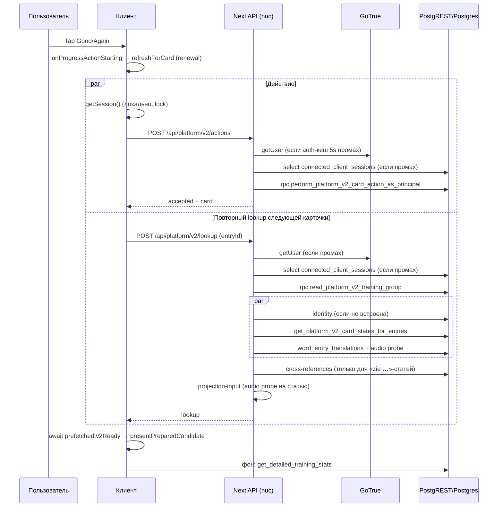

# Аудит задержек пользовательских действий (2026-09-30)

Статус: аудит кода, production-замеры (§0.1) и архитектурная рекомендация
(этап 1). Код приложения, схема и настройки БД не менялись. Замеры выполнены с
разрешения владельца на QA-аккаунте. Побочные эффекты: реальные ответы
QA-аккаунта (~90) и коллекция `latency-audit`. Все QA-сессии отозваны.

## 0. Границы и версия кода

| Что | Значение |
| --- | --- |
| Production (`GET https://2000.dilum.io/api/health`, 2026-09-30 19:01 UTC) | version `0.18.848`, commit `c6231f28`, DB contract `2000nl-db-178`, profile `pilot`, флаги `platformV2Lookup/Actions/IdiomExercises/TranslationExercises/TrainingUi/trainingTodaySetupV1 = true` |
| Локальный `main` | `c40069d4`, **на 117 коммитов позади** `origin/main`; миграции только до 156 |
| Что проверялось | read-only снимок `git archive c6231f28` (UI + `db/migrations` до 178) |

Файлы, на которых держатся основные выводы (клиент действий, аренда
предзагрузки, V2 lookup, серверная авторизация, проверка аудио, cross-reference
resolver, library-сессия, `listService`), **между локальным `main` и `c6231f28`
не менялись** — ссылки ниже на номера строк локального `main` для них
корректны. `TrainingScreen.tsx`, `useTrainingTurnController.ts` (+15 строк),
`TrainingSenseCardV2Session.tsx`, `pilot/*`, `statsService.ts` в production
отличаются. Для них указаны имена функций в `c6231f28`.

Обозначения: **F** — факт, проверенный по коду; **M** — измерение; **H** —
гипотеза, требует измерения; **?** — не проверено.

## 0.1 Production-замеры (2026-09-30, 21:50–22:45 CEST)

Условия:

- Браузер: headless Chromium на macOS, клиент в NL.
- Сеть: реальная, desktop; плюс «mobile-4g» — iPhone 13, RTT +100 мс,
  9/1,5 Мбит/с, CPU ×4.
- Данные: QA-аккаунт, VanDale 2k, meaning `word-to-definition`, сессии по
  10 карточек.
- Кеши: браузер холодный на старте прогона; кеши сервера — как в работе.

Инструменты:

- Существующие события `2000nl:training-transition-timing` и заголовки
  `Server-Timing`.
- Снимки `pg_stat_statements` до и после прогона. Разница — ровно SQL
  этого прогона: других пользователей в окне не было, см. число вызовов.
- Прямой замер SQL в `BEGIN READ ONLY` (`clock_timestamp` внутри
  PL/pgSQL).
- HEAD- и RTT-замеры изнутри production-контейнера.

Скрипты: [scripts/latency-audit/](../../scripts/latency-audit/); инструкция —
[production-latency-measurement.md](../runbooks/production-latency-measurement.md);
исходные данные —
[docs/diagnostics/2026-09-30-user-action-latency/](../diagnostics/2026-09-30-user-action-latency/).

### Окружение (M/F)

| Параметр | Значение |
| --- | --- |
| БД | Supabase eu-west-1, PG 17.6, `shared_buffers` 224 MB, `work_mem` 2 MB, `max_connections` 60; `statement_timeout` 8 s для `authenticated`/`authenticator` |
| Объём данных | `word_entries` 18 224 (74 MB), `dictionary_search_fields` 162 k, `user_review_log` 3 147, `user_card_status` 2 849; 8 пользователей с историей, максимум 1 625 ответов |
| RTT nuc → Supabase (n=20) | GoTrue health p50 48 / p95 234 мс; PostgREST RPC p50 56 / p95 410 мс |
| Контейнер UI | `public/audio` → `/home/khrustal/dev/2000nl-ui/db/audio` (**битая ссылка**), `PLATFORM_AUDIO_PUBLIC_ROOT` и `PLATFORM_AUTH_CACHE_TTL_MS` не заданы, 4 CPU, нагрузка ~0 |

### Ответ на карточку, desktop

n=54 перехода, ещё 6 — завершения сессий.

| Пауза перед ответом | `transition.total` p50 / p95 / max, мс | Доля продлений предзагрузки |
| --- | --- | --- |
| 0,5 с (n=15) | 343 / 1 234 / 1 234 | 0,20 |
| 3 с (n=12) | 611 / 1 528 / 1 528 | 0,75 |
| 8 с (n=15) | 636 / 1 375 / 1 375 | 1,00 |
| 20 с (n=12) | 951 / 2 580 / 2 580 | 1,00 |
| **С продлением (n=39)** | **644 / 2 338 / 2 580** | — |
| **Без продления (n=15)** | **345 / 1 234 / 1 234** | — |

Mobile-4g (n=22): с продлением 688 / 1 473; без — 385 / 1 006.
`card.render` p50 12, p95 38 мс, то есть CPU клиента узким местом не
является.

Стадии ответа, desktop, p50 / p95 / max, мс:

| Стадия | Значение |
| --- | --- |
| `review.mutation` (клиент) | 552 / 1 368 / 2 272 |
| `/api/platform/v2/actions` `route.auth` | 173 / 476 / 856 |
| — промах auth-кеша | **0,67** (actions), **0,83** (lookup) |
| — `auth.get-user` при промахе | 132 / 263 / 703 |
| — `auth.principal-session` при промахе | 79 / 320 / 366 |
| `/actions` `route.operation` (RPC) | 368 / 980 / 1 578 |
| Повторный lookup (`next-card.lookup`) | 537 / 1 520 / 2 575 |
| `/lookup` `lookup.exact-group` | 198 / 562 / 1 038 |
| `/lookup` `lookup.user-state` | 111 / 668 / 1 152 |
| `/lookup` `lookup.translations` (включая HEAD-пробу аудио) | 76 / 431 / 1 582 |
| `/lookup` `lookup.projection-input` | 1 / 11 / 20 |
| `/lookup` `lookup.cross-references` | 0 (в выборке не было «zie»-статей) |
| Прямые запросы к Supabase на ответ | `get_next_training_session_card` 101 / 186 |

### SQL за прогон (разница `pg_stat_statements`, 60 ответов, 5 стартов)

| Функция | Вызовов | Среднее, мс | Всего, с | Прямой вызов без нагрузки, мс |
| --- | --- | --- | --- | --- |
| `get_detailed_training_stats` | 58 | **1 310** | **76,0** | 220–260 (две половины по 110–140) |
| `perform_platform_v2_card_action_as_principal` | 58 | 301 | 17,5 | — (запись; напрямую не мерилось) |
| `read_platform_v2_training_group` | 124 | 125 | 15,5 | p50 8–14, p95 20–30 |
| `start_training_session` | 5 | 2 158 | 10,8 | — (запись) |
| `get_next_training_session_card` | 63 | 101 | 6,4 | 1–6 |
| `get_training_session_plan` | 5 | 1 267 | 6,3 | ~250 |
| `get_platform_v2_card_states_for_entries` | 124 | 39 | 4,8 | — |

Выводы:

- **Статистика дала ~54 % всего времени SQL за прогон.** Остальные функции
  под нагрузкой медленнее прямого вызова в 5–15 раз.
- Тест параллельности подтверждает конкуренцию за CPU:
  `get_detailed_training_stats` в 1 и 2 потока — ~230 мс, в 4 потока —
  430–1 040 мс. Это соответствует ~2 доступным vCPU.
- Независимо от параллельности наблюдались холодные выбросы после паузы:
  первый вызов тяжёлой функции занял 3,0 / 3,0 / 4,9 с при последующих
  ~230 мс. Свежий backend сам по себе такого не даёт (+10–30 мс, n=5).
  Причина — H: ограничение CPU burst на маленьком инстансе или соседи;
  нужны CPU-метрики Supabase.
- Исторический `pg_stat_statements` с 2026-05-16 показывает то же самое:
  - `read_platform_v2_training_group`: среднее 687 мс, максимум 7,86 с;
  - `get_detailed_training_stats`: 2,0–2,6 с;
  - `get_next_card`: 1,6–2,3 с;
  - `start_training_session`: 3,5 с;
  - много максимумов около 7,9 с — это упор в `statement_timeout` 8 s,
    то есть отказы запросов.

### Старт тренировки и загрузка страницы

- Клик Start → первая карточка (n=6): p50 **3 850**, p95 5 338 мс; mobile —
  тот же порядок. Внутри:
  - `start_training_session` — p50 2 309 / p95 2 602 мс в браузере;
  - V2 lookup — 724 / 2 188;
  - `get_training_session_plan` — 706 / 1 526;
  - `get_next_training_session_card` — 222 / 1 247;
  - `update_active_training_scope` — 173 / 432.
- `get_detailed_training_stats` (1 323 / 2 107) первую карточку **не
  блокирует** (`loadStats(scope)` без `await`), но нагружает ту же БД в тот же
  момент.
- Загрузка страницы → кнопка Start: 1 430 мс. Браузер делает 11 прямых
  запросов к Supabase. Среди них дважды `user_settings` и дважды
  `get_available_word_lists`.
- Отдельно: при первом замере `get_detailed_training_stats` на загрузке
  страницы занял 4,66 с.

### Проверка аудио (HEAD изнутри контейнера)

- n=40 случайных реальных файлов: p50 106, p95 162, max 241 мс; отказов 0.
- Затраты попадают в `lookup.translations` (цикл по статьям с переводом) и
  один раз на URL в 5 минут.

### Словарь и библиотека (desktop)

- Ввод «huis» по одной букве (120 мс/символ) дал **4 полных V2 lookup** —
  по одному на каждый символ.
  - Первые 3 параллельных запроса **все** промахнулись мимо auth-кеша:
    кеш заполняется только после ответа.
  - `route.auth` 285–370 мс, `lookup.db` 160–324 мс, клиент 470–831 мс на
    запрос.
  - После результата: `GET /auth/v1/user` из браузера (338 мс) и
    `get_user_list_memberships_for_entries`.
- Добавить или удалить слово из коллекции (n=4): **0,6 / 0,9 / 1,3 /
  2,5 с**, **13–20 запросов на одно нажатие**. В них входят:
  - 3 × `GET /auth/v1/user`;
  - запись `update_active_training_scope`;
  - `get_detailed_training_stats`;
  - до 3 × устаревшего `get_next_card` по ~1 с;
  - 1–3 × V2 lookup, 2 × `get_available_word_lists`, аудио.

  Причина (F): `LibrarySenseCardV2Session.onListsUpdated →
  TrainingScreen.handleListsUpdated`. Этот обработчик переписывает активную
  тренировочную область, перезагружает статистику и выполняет
  `replaceSessionScopeAndLoad` для **тренировки**, хотя пользователь только
  изменил коллекцию в библиотеке.

### Прочее наблюдение

После завершения сессии кнопка «Back to Today» ведёт на экран, где
завершённая сессия всё ещё показана активной, а кнопка «Continue session»
заблокирована (скриншот
`docs/diagnostics/2026-09-30-user-action-latency/screenshots/after-session-continue-disabled.png`).
Это UX-дефект, не задержка.

## 1. Карта сценариев и ожиданий

### 1.1 Ответ на тренировочную карточку (meaning, V2, сессия)



Цепочка (F):

1. [TrainingSenseCardV2Session.tsx](apps/ui/components/training/v2/TrainingSenseCardV2Session.tsx#L386-L415):
   `onProgressActionStarting()` запускается **до** запроса, затем
   `await performPlatformV2TrainingAction(...)`.
2. [platformV2TrainingActionClient.ts](apps/ui/lib/platform/platformV2TrainingActionClient.ts#L105-L155):
   `await platformV2AuthenticatedJsonHeaders()` → `supabase.auth.getSession()`
   ([platformV2Http.ts](apps/ui/lib/platform/platformV2Http.ts#L8)). Это локальное
   чтение под `navigator.locks`; сеть только при обновлении токена. Затем
   `fetch` с таймаутом **12 с** ([platformFetchWithTimeout.ts](apps/ui/lib/platform/platformFetchWithTimeout.ts#L1)).
   При транспортной ошибке или таймауте — `POST /actions/reconcile`, ещё до 12 с.
   Если reconcile отвечает «receipt not found», клиент выбрасывает ошибку,
   а не повторяет отправку.
3. Сервер: [platformV2ActionRouteService.ts](apps/ui/lib/platform/platformV2ActionRouteService.ts#L27-L96) →
   `getAuthenticatedSupabase`. Кеш авторизации **в памяти процесса, TTL 5 с**
   ([serverSupabase.ts](apps/ui/lib/platform/serverSupabase.ts#L54-L60)). При промахе
   последовательно выполняются `supabase.auth.getUser(token)` (HTTP к GoTrue) и
   `select … from connected_client_sessions` (HTTP к PostgREST)
   ([serverSupabase.ts](apps/ui/lib/platform/serverSupabase.ts#L260-L360)).
   При обычном темпе тренировки 3–10 с на карточку кеш часто промахивается (H).
4. Одна RPC `perform_platform_v2_card_action_as_principal` (13 аргументов,
   `db/migrations/153_single_active_training_run.sql` в `c6231f28`,
   L663–740): advisory lock по `(user, clientEventId)`, проверка receipt,
   `require_active_training_session_v1`, non-session latch (FSRS, receipt,
   события), `training_session_action_bindings`,
   `consume_training_session_member`. FSRS использует серверное
   `statement_timestamp()` через `private.training_reference_now_v1`
   (`148_training_reference_clock_seam.sql` L10–27). Время ответа клиента
   не передаётся.
5. Переход: [useTrainingTurnController.ts](apps/ui/components/training/useTrainingTurnController.ts#L732-L790):
   `await prefetched.v2Ready`, затем `presentPreparedCandidate`. Счётчики
   запускаются параллельно и не ожидаются.

**Главная находка — F1: существующая предзагрузка почти всегда
перезапрашивается в момент ответа.**

- `PREFETCH_TTL_MS = 30_000`
  ([platformV2TrainingClient.ts](apps/ui/lib/platform/platformV2TrainingClient.ts#L88)).
- `PLATFORM_V2_PROGRESS_ACTION_LEASE_WINDOW_MS = 12_000 × 2 + 4_000 = 28_000`
  ([platformV2TrainingActionClient.ts](apps/ui/lib/platform/platformV2TrainingActionClient.ts#L24-L31)).
- Условие продления: `existing.expiresAt − now ≤ 28_000`
  ([platformV2TrainingClient.ts](apps/ui/lib/platform/platformV2TrainingClient.ts#L169-L185)).
  Оно истинно для любой предзагрузки **старше ~2 с**.
- При ответе `refreshForCard` прерывает готовую запись и запускает новый
  `POST /api/platform/v2/lookup`. Затем он подменяет `candidate.v2Ready`
  ([usePreparedNextTrainingTurn.ts](apps/ui/components/training/v2/usePreparedNextTrainingTurn.ts#L173-L230)).
  Контроллер ждёт именно этот новый promise.
- Итог: `видимый переход ≈ max(T_action, T_lookup_заново) + render`. От
  предзагрузки остаётся только выбор кандидата (`next-card.selection`), а
  самая дорогая часть — полный V2 lookup — снова оказывается на критическом
  пути.
- Тесты это не ловят. Unit-тест
  ([platformV2TrainingClient.test.ts](apps/ui/tests/platformV2TrainingClient.test.ts#L1060-L1115))
  фиксирует продление через 2 с как ожидаемое поведение.
  `playwright/tests/training-prefetch-lease.spec.ts` проверяет только
  «немедленный» ответ через 350 мс и искусственный сдвиг к границе 30 с.
  Реалистичная пауза 3–20 с не покрыта.

Прочие ожидания на этом пути:

- **H2: проверка аудио на критическом пути lookup.**
  `verifyDictionaryContentAudioLinks` выполняется с `await` дважды: в
  `lookup.translations` — последовательно в цикле по статьям
  ([platformV2TranslationService.ts](apps/ui/lib/platform/platformV2TranslationService.ts#L101)) —
  и в `lookup.projection-input`
  ([platformV2LookupService.ts](apps/ui/lib/platform/platformV2LookupService.ts#L349)).
  Если `public/audio` внутри контейнера не читается и
  `PLATFORM_AUDIO_PUBLIC_ROOT` не задан, выполняется `HEAD` на
  `https://2000.dilum.io/audio/...` с таймаутом 1,2 с и кешем 5 мин на URL
  ([dictionaryContent.ts](apps/ui/lib/platform/projections/dictionaryContent.ts#L237-L280)).
  У каждой новой карточки URL новый, поэтому кеш промахивается.
  Косвенные признаки (F):
  - симлинк `apps/ui/public/audio` в git абсолютный:
    `/home/khrustal/dev/2000nl-ui/db/audio`;
  - в контейнер смонтирован только `/db/audio`
    ([docker-compose.yml](docker-compose.yml#L30-L31));
  - production `/audio/*` отдаётся через Caddy/Cloudflare с `etag` в формате
    Caddy, а не Next.

  Замер (M, n=3, с dev-машины): `HEAD /audio/...mp3` — 393 / 98 / 58 мс
  (первый — `cf-cache-status` холодный путь, далее HIT).

  **Подтверждено в production (F+M):** в контейнере ссылка битая, env не
  задан; из контейнера HEAD p50 106 / p95 162 мс (n=40).
- **F3: cross-references выполняются последовательно после `Promise.all`**
  ([platformV2LookupService.ts](apps/ui/lib/platform/platformV2LookupService.ts#L237-L335)).
  Для «zie …»-статей это до 8 параллельных `lookup_platform_v2_entries`,
  затем ещё `read_platform_v2_presentation_identity`
  ([platformV2CrossReferenceResolver.ts](apps/ui/lib/platform/platformV2CrossReferenceResolver.ts#L42-L85)).
  Этот этап зависит только от `entries`, и его можно выполнять параллельно с
  identity, state и translations.
- **F4: фоновые счётчики после каждого ответа.**
  `refreshAfterAccepted → loadStats → get_detailed_training_stats`. Эта
  RPC (`147`) вызывает и
  `private.get_detailed_training_stats_utc_legacy_v1`, и
  `private.training_local_daily_stats_v1` (`145`). В каждой есть CTE
  `accessible_entries` по `word_entries` с фильтром по спискам и `COUNT`
  по `user_review_log`, `user_card_action_events`, `user_card_status`.
  Дедупликация есть только для запросов, уже находящихся в полёте. Запрос
  конкурирует за PostgREST/Postgres со следующим действием и lookup (H: вклад
  в p95 при росте истории).
- **F5: таймауты.** Зависшее действие даёт до 12 с ожидания, потом ещё до
  12 с на reconcile. Ответ «receipt not found» становится ошибкой, хотя
  повторная отправка с тем же `clientEventId` безопасна благодаря receipt и
  advisory lock.

### 1.2 Подготовка следующей карточки (что уже есть)

| Этап | Где | Статус |
| --- | --- | --- |
| Выбор кандидата при показе текущей карточки | `usePreparedNextTrainingTurn` effect (L260–300), `get_next_training_session_card` | F, работает |
| V2 lookup кандидата | `warmWord → prefetchPlatformV2TrainingEntry` | F, но перезапрашивается при ответе (F1) |
| Перевод при отсутствии | `preparePlatformV2TrainingEntry`: request-translation → lookup с `bypassCache` | F; вне `v2Ready`, но `bypassCache` заменяет запись |
| Аудио | `preloadPlatformV2Audio` (клиентский кеш 2 мин, 24 записи) | F; не входит в `v2Ready` |
| Отмена | смена `loadGeneration`, несовпадение `forCardKey`, `exclude-pair` (`resetPreparedNextTurn`) | F |
| Телеметрия | исходы `reuse-*`, `renewal-*`, `accepted-hit-*`, `expired`, `cancelled`, `evicted`; `proactive-refresh-*` | F — метрики уже есть, но production не собирает их централизованно |

### 1.3 Старт и продолжение тренировки (`c6231f28`)

- Загрузка страницы: `getSession` (локально) → `fetchUserPreferences`
  (`user_settings` ∥ `get_learning_preferences`).
- Start/Continue (`useTrainingPilotController`):
  `update_active_training_scope` → `start_training_session` (`156`,
  материализованные кандидаты через `private.training_scheduler_candidates_v2`,
  последняя редакция `160`) → `get_detailed_training_stats` → первая карточка
  (`get_next_training_session_card` → V2 lookup). Цепочка
  **последовательная** (F). `get_detailed_training_stats` запускается без
  `await` и первую карточку не блокирует, но нагружает БД одновременно с
  ней (M, §0.1).
- `listService`: 6 вызовов `supabase.auth.getUser()` — это всегда сетевой
  запрос к GoTrue
  ([listService.ts](apps/ui/lib/training/listService.ts#L137), а также L529,
  L550, L639, L674, L717). Каждый добавляет лишний последовательный запрос в
  сценарии со списками (F).
- Смена языка, списка, режима или размера сессии полностью перезапускает
  сессию: scope → start → stats → карточка. Лишнего сверх этого не
  обнаружено (?).

### 1.4 Идиомы, предложения, word-in-context (`c6231f28`)

- Идиомы (`pilot/TrainingIdiomSession.tsx` L232–257) и предложения
  (`pilot/TrainingSentenceSession.tsx` L57–128): `await action →
  await next RPC → await загрузка контента (V2 library lookup) → render`.
  **Предзагрузки нет**: 3 последовательных сетевых запроса на каждый
  переход, плюс RPC статистики на каждый `completedCount` (F). По числу
  последовательных запросов это худший тренировочный путь.
- Для предложений `loadSentenceExerciseContent` может запросить перевод
  (провайдер) до показа (F для вызова; время — H).
- Word-in-context: `sessionState = loading`, пока не готов
  `loadWordContextPrompt` (RPC + library lookup). Следующий перевод
  прогревается только после готовности текущего. Действие ждёт запись
  hint-evidence (F).

### 1.5 Словарь

- Поиск ([DictionarySearchTab.tsx](apps/ui/components/training/wordlist/DictionarySearchTab.tsx#L208-L240)):
  `query` обновляется на каждый `onChange` (L536), эффект `runSearch`
  срабатывает **без debounce**. Устаревшие ответы отбрасываются по
  `requestId`, но запросы не прерываются (F по коду; прерывание в
  `fetchPlatformV2LibraryGroupPage` — ?). Каждая буква запускает полный V2
  lookup: БД, identity, state, translations, cross-refs, projection.
- Открытие результата: `fetchDictionaryEntryById` (v1 action) догружает
  данные, которые уже частично есть (F). Cross-reference — отдельный V2
  lookup.
- Копирование и создание статьи в пользовательском словаре: действие → второй
  запрос для гидратации, последовательно (F).
- Историческая диагностика 2026-06-24 устарела. После неё добавлены
  миграции `093`–`101`, а `lookup_platform_v2_entries` и
  `read_platform_v2_training_group` в последней редакции определены в `119`.
  Нужен новый EXPLAIN (§5).

### 1.6 Библиотека

- Действие над карточкой
  ([LibrarySenseCardV2Session.tsx](apps/ui/components/training/library-v2/LibrarySenseCardV2Session.tsx#L361-L383)):
  `await action → await load()` (полный V2 lookup группы). Ответ действия уже
  содержит новое `card`-состояние, но не используется для локального
  обновления (F).
- Список (L418–442): `getUser` (GoTrue) → `add_entry_to_user_list` →
  `getUser` → `get_user_list_memberships_for_entries` → `onListsUpdated`
  (`getUser` + RPC списков). Итого около 6 последовательных запросов; кнопка
  списка заблокирована всё это время (F). Для подтверждения достаточно
  ответа записи.

### 1.7 Перевод и звук

- Library-перевод: запрос → при `pending` опрос раз в 3 с → при `ready`
  полный `load()` (F).
- Тренировка: `request-translation` → `await load(..., usePrefetch:false)` (F).
- Звук: `resolvePlatformV2Audio` сначала смотрит клиентский кеш предзагрузки.
  При промахе — `POST /api/platform/audio/resolve`, и на холодном пути TTS
  синтезируется синхронно (Google/Azure), без явного таймаута (F/?). Для
  `listen-recognize` готовность карточки (`v2Ready`) **не** включает аудио.
  Минимум для этого режима: resolved URL и `canplay` первого буфера (?).

## 2. Рейтинг проблем (после production-замеров)

Частота × задержка × влияние. Цифры — из §0.1.

| # | Проблема | Тип | Частота | Измеренный вклад | Влияние |
| --- | --- | --- | --- | --- | --- |
| 1 | Продление предзагрузки: полный lookup снова на критическом пути | F+M | 75 % при паузе 3 с, 100 % при ≥ 8 с | p50 345 → 644 мс, p95 1 234 → 2 338 мс | Ритм тренировки |
| 2 | Конкуренция за CPU маленькой БД; главный потребитель — `get_detailed_training_stats` после каждого ответа | M | каждый ответ | 54 % SQL-времени; соседние RPC в 5–15 раз медленнее прямого вызова | Все сценарии |
| 3 | Auth-кеш 5 с, без слияния параллельных промахов | F+M | промах 67–83 % | `route.auth` p50 173–202, p95 476–503 мс на запрос | Все API |
| 4 | Старт: `start_training_session` + `get_training_session_plan` + lookup последовательно | M | каждый старт | 3,9 / 5,3 с (p50 / p95) | Вход в тренировку |
| 5 | Идиомы и предложения: 3 последовательных запроса без предзагрузки | F (не замерялось) | каждый ответ | оценка ≥ action + next + lookup ≈ 1,2–1,5 с | Ритм упражнений |
| 6 | Коллекция в библиотеке запускает перезагрузку тренировки (запись scope, stats, 3 × `get_next_card`) | F+M | каждое нажатие | 0,6–2,5 с, 13–20 запросов | Библиотека + побочный эффект на тренировку |
| 7 | Поиск без debounce и abort | F+M | каждая буква | 4 полных lookup на «huis», 470–830 мс каждый | Словарь, нагрузка на БД |
| 8 | Холодные выбросы БД 3–5 с после простоя; упор в 8 s timeout | M + H (причина) | редко, но заметно | 3–8 с, иногда отказ | Первое действие после паузы |
| 9 | Серверная HEAD-проба аудио (битый симлинк) | F+M | новая статья с переводом | 106 / 162 мс на статью, внутри `lookup.translations` | Тренировка, словарь |
| 10 | Cross-refs после `Promise.all` | F | только «zie»-статьи (в выборке 0) | +1–2 RPC-раунда | Словарь |
| 11 | reconcile 404 → ошибка вместо повтора; таймаут 12 + 12 с | F | редко | до 24 с | Сбои сети |

Раскладка типичного ответа без продления (p50 ≈ 345–550 мс), критический
путь = `/actions`:

- браузер → nuc ~50 мс;
- `route.auth` 0 или ~210 мс — два последовательных запроса к Supabase при
  RTT ~50 мс;
- RPC ~300 мс: SQL под конкуренцией плюс ~50 мс RTT;
- render ~5 мс.

С продлением к этому добавляется параллельный `/lookup` (~540 мс). Переход
берёт большую из двух ветвей, а обе конкурируют за одну и ту же БД вместе со
статистикой. Паузы 1,5–2,6 с (p95/max) — это совпадение продления, промаха
auth и SQL под нагрузкой.

## 3. Фоновая запись ответа: сравнение вариантов

Общие факты для всех вариантов:

- В сессии порядок участников заранее запланирован. Признаков повторной
  постановки «проваленной» карточки внутри сессии в миграциях 139–178 не
  найдено (F, частично). Значит, выбор следующей карточки от результата
  текущего ответа не зависит (нужен характеризационный тест).
- Сервер отклоняет новое действие для вытесненной сессии
  (`require_active_training_session_v1`), если receipt ещё не существует.
- Устаревший `stateRevision` даёт `state_conflict`.
- Время FSRS — серверное время применения, а не время ответа.
- Общие состояния meaning по направлениям (`138_shared_meaning_directional_state`):
  следующая карточка с тем же `entryId` может получить новую `stateRevision`
  из-за текущего ответа.

| | A. Ждать подтверждения, ускорить путь | B. Следующая карточка сразу, запись в фоне при открытом приложении (+ сохранение намерения) | C. Устойчивая локальная очередь с синхронизацией после перезапуска/офлайна |
| --- | --- | --- | --- |
| Выигрыш | Убирает #1, #3, #4, #5: переход ≈ 1 раунд действия (`RTT + auth + RPC`) | Видимый переход ≈ render (< 100 мс), если следующая карточка тёплая; подтверждение то же, но вне критического пути | Как B, плюс работа без сети |
| Сложность | Низкая | Средняя | Высокая |
| Семантика | Без изменений: интерфейс сдвигается только после receipt | Интерфейс сдвигается до receipt. Статус записи показывается отдельно | Результат может быть применён через часы; FSRS и лимиты «сегодня» смещаются |
| Требует контракта БД | Нет | Нет, если сохраняется окно в секунды | Да: `client_answered_at` с серверными границами, правила для вытесненных сессий, офлайн-выбор карточек |
| Главный риск | Остаётся зависимость от RTT | Отказ записи после того, как пользователь прошёл дальше | Конфликты между устройствами, дрейф FSRS, отсутствие Background Sync на iOS |

### Поведение по состоянию приложения

| Состояние | A | B | C |
| --- | --- | --- | --- |
| Открыто | Ожидание receipt | Очередь FIFO, повторы с тем же `clientEventId` | То же |
| Свёрнуто | Запрос может быть прерван ОС; при возврате — reconcile | Браузер замедляет таймеры, iOS приостанавливает страницу. Очистка очереди по `visibilitychange` при возврате | Service Worker + Background Sync — только Chromium. Сейчас Service Worker **нет** (F), manifest есть |
| Закрыто | Ответ в полёте мог записаться; по `clientEventId` не сверить после перезапуска | `fetch(..., {keepalive:true})` может доставить запрос. Намерение хранится в IndexedDB; при следующем запуске выполняется reconcile или повторная отправка | Как B; фоновая отправка без открытия — только при Background Sync (не iOS/WebKit, не Firefox по публичным данным — **проверить на целевых устройствах**) |

### Обязательные свойства варианта B

1. **Намерение сохраняется до переключения карточки.** Запись в IndexedDB
   `{userId, clientEventId, sessionId, target(entryId, cardTypeId,
   stateRevision), reviewResult, answeredAt, attempt, status}`. Прецедент —
   outbox диагностических отчётов в
   [diagnosticReportClient.ts](apps/ui/lib/feedback/diagnosticReportClient.ts#L442).
   Если запись в IndexedDB не удалась, откат к варианту A для этого ответа.
2. **Повторы.** Всегда тот же `clientEventId`. Ответ «receipt not found»
   от reconcile — повтор с `x-platform-action-attempt: 2`. Экспоненциальная
   задержка. `duplicate` считается успехом.
3. **Порядок.** Одна FIFO-очередь на пользователя и вкладку, одновременно не
   больше одного запроса в полёте. Между вкладками действует существующий
   single-active-run fence (`153`): вытесненная вкладка получает
   `training_session_superseded`. Её очередь должна **дослать** свои записи
   до освобождения или показать «нужна помощь». Серверная политика «принять
   ответ для недавно вытесненной сессии, если участник был в ней» — отдельное
   продуктовое решение.
4. **Глубина.** Не больше 2 неподтверждённых ответов. Дальше — синхронное
   ожидание с индикатором «Сохраняем…».
5. **Когда нельзя переходить заранее (откат к A):**
   - следующая карточка имеет тот же `entryId`;
   - `mark-known` или `undo-known` — undo требует ревизию из ответа;
   - `exclude-pair`;
   - достигнут лимит сессии: экран завершения ждёт подтверждения всех
     ответов;
   - подготовка не готова.
6. **FSRS.** В окне секунд `statement_timestamp()` приемлем. Если
   неподтверждённый ответ старше порога (например, 5 мин или граница
   учебного дня), автоматический повтор прекращается: статус «нужна помощь»,
   пользователь решает сам. Для C нужен `client_answered_at`.
7. **Лимиты и счётчики.** Локальный счётчик сессии учитывает ответы в очереди
   как «ожидают». Серверные счётчики обновляются после подтверждения, одним
   объединённым запросом.
8. **Потеря ответа после успешной записи.** reconcile по `clientEventId`
   возвращает authoritative receipt, запись помечается «сохранено».
9. **Отказ после нескольких следующих карточек.** `state_conflict`,
   `member_not_available`, `superseded` → ненавязчивое уведомление «Ответ на
   «X» не сохранён» с действием «Повторить карточку». Последующие ответы от
   этого не зависят: у каждой карточки своя ревизия.
10. **Авторизация и выход.** Очередь привязана к `userId`. При отказе
    refresh-токена очередь ставится на паузу: «Войдите снова, N ответов
    ожидают». При выходе из аккаунта — предупреждение, если очередь не
    пуста. Никогда не отправлять записи под токеном другого пользователя.
11. **UI.** Индикатор в футере сессии: «ожидает отправки (N)» → исчезает при
    «сохранено»; «нет сети — отправим позже»; «нужна помощь» со списком.

### Рекомендация

1. **Сначала A**: P1.1–P1.6 в §4. Оценка по замерам:
   - отказ от продления — p50 644 → ~345 мс, p95 2 338 → ~1 234 мс;
   - auth-кеш снимает ещё ~170 мс p50 и до ~480 мс p95;
   - убрать статистику из каждого ответа — освободить ~половину CPU БД
     и приблизить RPC к прямым временам.

   Ожидаемый итог A — p50 < 300 мс, p95 < 700 мс на ответ (H, проверить
   повторным прогоном тем же скриптом). Решение о B — **после** этого замера.
2. **Затем B** под флагом, только для `review-card` и `start-learning` в
   сессионном режиме, с сохранением намерения в IndexedDB и reconcile при
   запуске. Предварительные условия: характеризационные тесты текущих
   контрактов action, reconcile и сессионного fence, а также тест
   «результат не влияет на выбор следующей карточки в сессии».
3. **C не делать**, пока нет требования работать офлайн. Он требует изменения
   контракта БД, Service Worker и даёт реальную фоновую отправку только в
   Chromium.

## 4. План изменений

Каждое изменение — отдельный PR; откат — revert или флаг.

| ID | Изменение | Критерий приёмки | Проверка корректности | Метрика | Откат |
| --- | --- | --- | --- | --- | --- |
| P0.1 | Production RUM: сэмплированная отправка существующих событий `2000nl:training-transition-timing` и `Server-Timing` (без тел запросов и токенов) | p50, p95, max и n по стадиям в разрезе версии и устройства | Проверка приватности по правилам harness | Базовая линия | Флаг выключения |
| P1.1 | Разделить свежесть и срок жизни предзагрузки: не продлевать готовую запись, если до истечения больше 28 с. Поднять TTL готовой записи до 5–10 мин либо закреплять её при захвате переходом. Продлевать только при совпадении `entryId` с текущей карточкой | Доля `renewal-required` < 5 % при паузе 2–60 с (сейчас 75–100 %); p95 `transition.total` ≤ 1 300 мс (сейчас 2 338) | Новые unit-тесты с паузами 5 и 25 с; e2e lease-spec; `state_conflict` на следующей карточке обрабатывается как сейчас | `scripts/latency-audit/train.mjs` + `analyze.mjs` | Revert констант |
| P1.2 | Аудио-проба (битый симлинк подтверждён): задать `PLATFORM_AUDIO_PUBLIC_ROOT=/db/audio` в prod env (без изменения кода); затем сделать симлинк относительным или убрать его из образа | `lookup.translations` p95 < 150 мс (сейчас 431) | Отсутствующий файл по-прежнему скрывает аудио-кнопку (existing tests) | Server-Timing | Удалить env |
| P1.3 | Auth: TTL кеша 60 с через env; слияние параллельных промахов по токену (один promise на хеш); затем TTL ≤ `exp − now` и локальная проверка JWT для first-party | `auth.cache-hit` > 95 % в тренировке (сейчас 17–33 %); `route.auth` p95 < 20 мс | Отозванный токен connected client отклоняется не позже TTL — зафиксировать как принятый риск | `route.auth` p95 | Env |
| P1.4 | Cross-refs параллельно с identity, state и translations | `lookup.total` ≈ max этапов | Существующие тесты cross-reference | Server-Timing | Revert |
| P1.5 | reconcile 404 → одна повторная отправка с attempt 2 | Нет пользовательской ошибки при потере запроса до коммита | Тест: dedupe по receipt | `[platform.training.review]` outcomes | Revert |
| P1.6 | Статистика: не вызывать `get_detailed_training_stats` после каждого ответа. Счётчики сессии вести локально из receipt, полный пересчёт — в конце сессии или в idle ≥ 5 с. Затем объединить legacy и local-daily в один проход | ≤ 1 stats-RPC на сессию из 10 (сейчас ~1 на ответ); доля stats в SQL-времени < 15 % (сейчас 54 %); `perform_platform_v2_card_action_as_principal` mean < 120 мс (сейчас 301) | Итоговые счётчики совпадают с серверными после паузы; тесты local study day (`145`–`147`) | Снимки `pg_stat_statements` до и после (`db-09-snapshot.sql`, `pgss-diff.mjs`) | Revert |
| P1.9 | Library → тренировка: изменение коллекции не должно вызывать `TrainingScreen.handleListsUpdated` (запись scope, stats, `replaceSessionScopeAndLoad`, legacy `get_next_card`). Обновлять только список коллекций, тренировку — лениво при возврате, если изменился именно активный список | ≤ 3 запроса на переключение (сейчас 13–20); p95 < 400 мс (сейчас до 2,5 с); нет записи `update_active_training_scope` | Характеризационный тест: активная сессия не меняется при правке неактивной коллекции | `scripts/latency-audit/library-collections.mjs` | Revert |
| P1.10 | Старт: после успеха `start_training_session` сразу запускать lookup первой карточки из ответа (вернуть первую карточку в ответе RPC); не вызывать `get_training_session_plan` на критическом пути | Клик Start → карточка p50 < 1,5 с (сейчас 3,85) | Тесты single-active-run (`153`) и session size | `train2.mjs` (старты) | Revert |
| P1.11 | Выяснить холодные выбросы БД 3–5 с: CPU и IO бюджет в Supabase Reports, тип compute. При подтверждении burst-лимита — повышение compute как обратимый эксперимент | Нет выбросов > 1 с в первом вызове после 10 мин простоя (n ≥ 10) | — | `db-05`/`db-07` после паузы | Понизить compute |
| P1.7 | Поиск: debounce 200–250 мс + `AbortController` | ≤ 1 запрос на паузу ввода | Порядок результатов (existing tests) | Запросов на запрос пользователя | Revert |
| P1.8 | Library: `userId` из сессии вместо `getUser`; локальное обновление принадлежности из ответа записи; `onListsUpdated` в фоне; состояние карточки из ответа действия | Кнопка разблокирована после ответа записи | Характеризационные тесты `listService` | Запросов на действие | Revert |
| P2.1 | EXPLAIN (ANALYZE, BUFFERS) на снимке prod для `read_platform_v2_training_group`, `get_platform_v2_card_states_for_entries`, action-RPC (в `BEGIN … ROLLBACK`), `get_next_training_session_card`, `start_training_session`, `get_detailed_training_stats`, `search_dictionary_groups_v1`; `pg_stat_statements` | Нет seq scan по `user_review_log` и `word_entries` на горячих путях | FSRS parity: `scripts/db-local-supabase.sh test-fsrs` | SQL-время отдельно от RPC | Миграция вперёд |
| P2.2 | Предзагрузка следующего упражнения для идиом и предложений: следующий кандидат и контент, как в meaning | Переход ≈ 1 раунд действия | Тесты session consumer (`155`, `166`) | `transition.total` для упражнений | Флаг |
| P3.1 | Вариант B под флагом (§3) | Видимый переход p95 < 150 мс на тёплой карточке; 0 потерянных ответов в fault-injection | Сценарии §3.1–11 в Playwright с отключением сети, reload и двумя вкладками | Время до подтверждения, доля «нужна помощь» | Флаг |

## 5. Измерения: сделано и осталось

Сделано 2026-09-30 (§0.1):

- 60 ответов desktop, 24 ответа mobile-4g, 11 стартов сессии.
- Поиск и коллекции.
- Разница `pg_stat_statements`, прямые замеры SQL, тест параллельности.
- RTT и HEAD из контейнера, конфигурация контейнера.

Повторить:

```sh
bash scripts/latency-audit/run.sh train.mjs 60 "500,3000,8000,20000" desktop
(cd apps/ui && node ../../scripts/latency-audit/analyze.mjs ../../tmp/latency-audit/out/desktop-*.jsonl)
```

Осталось:

1. Идиомы, предложения, word-in-context, перевод по кнопке, холодный
   TTS — в production не замерялись (требуют подготовки QA-данных).
2. Реальные устройства (iPhone PWA, Android): только эмуляция. Перед
   решением по C проверить `serviceWorker`, `SyncManager`, `fetch keepalive`
   и `visibilitychange` на устройствах.
3. CPU- и IO-метрики Supabase для холодных выбросов (P1.11).
4. Реплики у проекта нет. Все замеры SQL сделаны на primary в
   read-only-транзакциях. Записывающие RPC (action, `start_training_session`)
   измерены только через `pg_stat_statements`.
5. P0.1 — постоянный RUM, чтобы видеть реальных пользователей, а не только
   QA.

## 6. Реализация: ветка `codex/439-action-latency`

База — `c6231f28` (production на момент аудита). Каждое изменение — отдельный
коммит.

| Пункт плана | Коммит | Что сделано | Тесты |
| --- | --- | --- | --- |
| P1.1 | `21cdda75` | Готовая подготовка младше 5 минут переживает ответ (`lease-extended`) без повторного lookup. Соседнее направление того же значения перечитывается после коммита действия (`same-meaning-revalidate`), потому что Learn/Known общие (`138`) | unit: продление, обновление старой записи; controller: перечитывание; e2e `training-prefetch-lease` |
| P1.3 | `3a2c6650` | Одновременные промахи auth-кеша по одному токену сливаются в одну проверку. First-party кешируется до 60 с, но не дольше `exp − 5 с`; connected-client остаётся на 5 с | `serverSupabaseAuthCache.test.ts` |
| P1.2 | `3864faf3`, `73b11fd5` | Относительный симлинк `public/audio → ../../../db/audio` и `PLATFORM_AUDIO_PUBLIC_ROOT=/db` в `docker-compose.yml`. Тесты больше не зависят от битой ссылки | `platformDictionaryContent.test.ts` |
| P1.4 | `669e44d8` | Cross-references параллельно с identity, state и translations | lookup route, resolver |
| P1.6 | `0412f5d5` | Статистика после ответа: один отложенный запрос (1,5 с после ответа, не чаще раза в 10 с), при завершении сессии — сразу | controller |
| P1.7 | `56d1e12e` | Debounce ввода 250 мс; новый поиск прерывает предыдущий | `DictionarySearchTab.grouping` |
| P1.8 + P1.9 | `f0e3acbd` | Изменение коллекции не сбрасывает тренировку, если активный список не изменился. Переключатель освобождается после сохранения. `listService` берёт пользователя из локальной сессии вместо `getUser()` | `LibrarySenseCardV2Session`, `trainingService.listsPreferences` |

Проверки: `npm run typecheck` — ок; `npm run lint` — только одно старое
предупреждение; vitest в чистом окружении — 1192 passed.

Playwright на порту 3101 (порт 3100 занят другим агентом):
- `training-prefetch-lease` и 20 training-спеков — зелёные;
- `training-secondary-actions` не запускается на порту 3101: в спеке
  зашит origin `127.0.0.1:3100`.

Не сделано в этой ветке (осознанно):

- **P1.5 (повтор после reconcile 404).** Текущий контракт намеренно
  возвращает типизированный `action_receipt_not_found`, а аренда
  рассчитана ровно на 2 запроса. Требует отдельного решения.
- **P2.2 (предзагрузка идиом и предложений).** RPC «следующее упражнение»
  возвращают первый непотреблённый элемент сессии. Для предзагрузки нужен
  контракт peek/exclude — это миграция БД и отдельная задача.
- **P1.10, P1.11 (первая карточка, CPU Supabase).** Принадлежат #421/#442 и
  #440/#443 программы #439.
- **Вариант B.** Решение — после повторного production-замера по §5.

Приёмка после деплоя — тот же прогон:

```sh
bash scripts/latency-audit/run.sh train.mjs 60 "500,3000,8000,20000" desktop
```

Плюс разница `pg_stat_statements`. Целевые значения — в колонке «Критерий
приёмки» §4.

## 7. Что вызывало задержки, почему исправили и чего это стоит

Каждый раздел: **причина** (что происходило и сколько стоило по замерам
§0.1), **почему исправили**, **цена** (какие задержки, риски или UX-компромиссы
появились взамен).

### 7.1 Повторная загрузка подготовленной карточки

**Причина.** Следующая карточка готовится заранее, но её запись в кеше жила
30 с. Перед отправкой ответа клиент требовал, чтобы запись оставалась
действительной ещё 28 с. В итоге любая подготовка старше ~2 с выбрасывалась, и
полный V2 lookup (авторизация, группа, состояние, переводы, проверка аудио)
запускался заново одновременно с отправкой ответа. Переход ждал более медленный
из двух запросов. Это происходило в 75 % ответов после паузы 3 с и в 100 %
после 8 с и дольше:

- с повторной загрузкой: p50 644 мс, p95 2 338 мс;
- без неё: p50 345 мс, p95 1 234 мс.

**Почему исправили.** Это главный источник пауз в 1–2 с при обычном темпе
чтения. Готовая карточка уже есть; повторная загрузка её почти никогда не
меняет.

**Цена.**

- Карточка может быть показана по данным возрастом до 5 минут. Если за это
  время её состояние изменили на другом устройстве, следующий ответ получит
  `state_conflict`. Это уже обрабатывается как устаревшее состояние и не
  портит данные: FSRS остаётся авторитетным на сервере. Раньше та же ситуация
  возникала при быстрых ответах (< 2 с).
- Если следующая карточка — другое направление того же значения, она
  перечитывается **после** сохранения ответа: Learn/Known общие для обоих
  направлений. На таких переходах добавляется один lookup (~0,3–0,5 с), зато
  нет риска показать устаревшее состояние.

### 7.2 Проверка авторизации на сервере

**Причина.** Кеш проверки токена жил 5 с. При темпе 3–20 с на карточку он
промахивался в 67–83 % запросов. Каждый промах — два последовательных
запроса к Supabase (GoTrue `getUser` и поиск connected-client сессии): p50
~170–200 мс, p95 ~480 мс. Параллельные запросы (ответ + lookup, поиск по
буквам) промахивались одновременно и делали эту работу по несколько раз.

**Почему исправили.** Это постоянная надбавка на **каждый** API-запрос, не
связанная с бизнес-логикой.

**Цена.**

- Для first-party токенов проверенный пользователь кешируется в памяти
  процесса до 60 с, но не дольше срока действия токена. Выход из аккаунта на
  другом устройстве или блокировка пользователя замечаются сервером с
  задержкой до 60 с. Это близко к поведению самого JWT, который и так
  действителен до `exp`.
- Для connected clients (AudioFilms, Pontix) остаётся 5 с: их доступ можно
  отозвать, и задержку отзыва увеличивать нельзя.
- Небольшой рост памяти: до 256 записей, как и раньше.

### 7.3 Проверка аудио через HTTP

**Причина.** Ссылка `apps/ui/public/audio` в git была абсолютной, на путь
разработчика. В production-контейнере она битая, поэтому сервер для каждой
новой статьи проверял аудио HEAD-запросом на публичный сайт через Cloudflare:
p50 106 мс, p95 162 мс на карточку.

**Почему исправили.** Файлы лежат на смонтированном томе. Сетевая проверка —
чистая потеря времени и лишняя зависимость от внешней сети.

**Цена.** Практически нет: проверка стала синхронным `stat` файла
(микросекунды). Если том не смонтирован, поведение прежнее — аудио-кнопка
скрывается для отсутствующих файлов. Нужен деплой с новым
`docker-compose.yml` (переменная `PLATFORM_AUDIO_PUBLIC_ROOT=/db`).

### 7.4 Перекрёстные ссылки после остальных этапов

**Причина.** Для статей вида «zie …» поиск цели ссылки (до 8 lookup-RPC и
identity) запускался только после identity, состояния и переводов, хотя от
них не зависит. В замеренной выборке таких статей не было; эффект —
+1–2 последовательных RPC-раунда на таких статьях.

**Почему исправили.** Бесплатная параллельность без изменения результата.

**Цена.** На таких статьях в момент lookup одновременно выполняется больше
RPC, то есть кратковременно выше пиковая нагрузка на БД. Суммарная работа не
меняется.

### 7.5 Статистика после каждого ответа

**Причина.** После каждого принятого ответа клиент вызывал
`get_detailed_training_stats` — две полные агрегации (UTC и локальный
учебный день) по списку и истории. Одна такая RPC — ~230 мс CPU, под
нагрузкой — 1,3 с. Она заняла 54 % SQL-времени прогона и замедляла
параллельные запись ответа и lookup: на маленьком инстансе ~2 vCPU.

**Почему исправили.** Это крупнейший потребитель CPU базы, и он работал
именно в момент перехода к следующей карточке.

**Цена.**

- Счётчики в футере тренировки («новые/повторения/всего») обновляются не
  после каждого ответа, а через 1,5 с после ответа и не чаще раза в 10 с. Во
  время серии они могут отставать на 1–3 ответа.
- В конце сессии обновление выполняется сразу, поэтому итог сессии точный.
- Сама SQL-функция не менялась; её оптимизация — отдельная миграция.

### 7.6 Поиск в словаре

**Причина.** Каждая буква запускала полный V2 lookup (470–830 мс), и
предыдущие запросы не отменялись: «huis» дал 4 одновременных запроса, и все
промахнулись мимо auth-кеша.

**Почему исправили.** Результаты промежуточных букв никто не видит, а они
нагружают БД и сервер.

**Цена.**

- Результаты при наборе появляются на 250 мс позже последнего нажатия.
- Восстановленный запрос, листание страниц и фильтры выполняются сразу, без
  задержки.

### 7.7 Коллекции в библиотеке и тренировка

**Причина.** Добавление или удаление слова в коллекции занимало 0,6–2,5 с и
13–20 запросов:

- обработчик «списки обновлены» из библиотеки вызывал тренировочный
  `handleListsUpdated`. Тот **завершал активную тренировочную сессию** (id
  сессии, состояние продолжения, очередь), переписывал активную область
  тренировки, перезапрашивал статистику и заново выбирал карточки через
  устаревший `get_next_card` — даже когда активный список не менялся;
- кнопка коллекции ждала всё это;
- каждый вызов `listService` начинался с сетевого `getUser()`.

**Почему исправили.** Кроме задержки это была ошибка корректности: правка
коллекции в библиотеке тихо сбрасывала идущую тренировку.

**Цена.**

- Если пользователь добавил слово в коллекцию, которая сейчас выбрана для
  тренировки, текущая сессия не пересоздаётся. Новое слово появится в
  следующей сессии, как и для любой уже запланированной сессии.
- Счётчики списков в других местах интерфейса обновляются в фоне, через долю
  секунды после сообщения «сохранено».
- `listService` берёт id пользователя из локальной сессии. Безопасность не
  меняется: RPC по-прежнему проверяют `auth.uid()` на сервере. Если локальная
  сессия устарела, запрос получит отказ от сервера, а не от предварительной
  проверки.

### 7.8 Что осталось и почему

| Проблема | Цена оставить как есть | Почему не исправлено здесь |
| --- | --- | --- |
| Старт тренировки 3,9 / 5,3 с (p50/p95) | Долгий вход в тренировку | Принадлежит #421/#442; нужен пересмотр `start_training_session` и плана сессии |
| Идиомы и предложения без предзагрузки (3 последовательных запроса) | ~1,2–1,5 с на переход (оценка) | RPC «следующее упражнение» не умеет смотреть вперёд; нужна миграция peek/exclude |
| Холодные выбросы БД 3–5 с и упор в 8 s timeout | Редкие долгие паузы и отказы | Нужны CPU-метрики Supabase и решение по compute (#440/#443) |
| Повтор после reconcile 404 | Редкая ошибка при потере сети | Контракт сознательно типизирован; нужно отдельное решение |
| Показ следующей карточки до подтверждения (вариант B) | Переход ≈ время записи ответа | Решать по замеру после этих исправлений |

## 8. Как повторить исследование

Пошаговая инструкция, правила безопасности и известные ловушки —
[docs/runbooks/production-latency-measurement.md](../runbooks/production-latency-measurement.md).
Скрипты — [scripts/latency-audit/](../../scripts/latency-audit/). Исходные
данные этого прогона (JSONL переходов, разница `pg_stat_statements`,
исторический `pg_stat_statements`, скриншоты) —
[docs/diagnostics/2026-09-30-user-action-latency/](../diagnostics/2026-09-30-user-action-latency/).
Для сравнения «до/после» используйте те же паузы (`500,3000,8000,20000`),
60 ответов и тот же QA-аккаунт.
