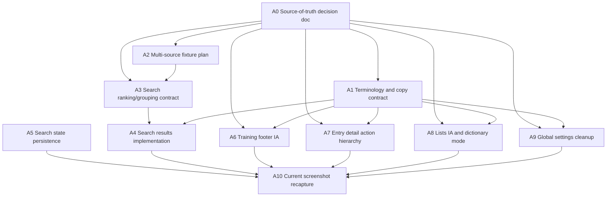

# Search Lists Multisource UX Remediation Roadmap

Date: 2026-05-26

## Goal

Turn the senior UX review into an ordered implementation map that can be handed
to agents one slice at a time.

The next pass must stabilize the product model before adding more language,
dictionary, list, or training controls. The core problem is not visual polish.
The UI currently blurs four separate objects:

- dictionary source;
- list;
- search scope;
- training session/settings.

This roadmap is intentionally dependency-driven. Do not ask agents to redesign
footer, settings, lists, and search independently without first defining the
source-of-truth model.

## Evidence

Primary review package:

- `review-packages/search-lists-ui-audit/2000nl-search-lists-ux-review-package-2026-05-26.zip`
- `review-packages/search-lists-ui-audit/current-screenshots/`
- `review-packages/search-lists-ui-audit/ux-followup-brief-2026-05-26.md`

Most important screenshots:

- `01-current-training-main.png`
- `02-current-training-detail-sidebar.png`
- `03-current-search-huis-results.png`
- `04-current-lists-default.png`
- `05-current-search-after-tab-return.png`
- `06-current-lists-dictionary-mode-toggle.png`
- `07-current-lists-training-settings.png`
- `08-current-global-settings.png`

## Non-Negotiable Product Model

Before broad UI work, the app needs explicit terms and precedence:

1. Dictionary source owns entries and dictionary metadata.
2. List is an entry collection used for training or organization.
3. Training session is what the learner is practicing now.
4. Preferences are defaults only.

Precedence:

1. One-off action, such as "train this word next".
2. Current session controls.
3. List defaults/recommendations.
4. Global preferences.

## Dependency Map



## Recommended Execution Order

### Phase 0: Model Before UI

Run these first.

1. A0 Source-of-truth decision doc.
2. A1 Terminology and copy contract.
3. A2 Multi-source fixture plan.
4. A3 Search ranking/grouping contract.

Do not start large UI reshuffles until A0 and A1 are complete.

### Phase 1: Low-Risk Product Fixes

Can start after A0/A1, with minimal visual risk.

5. A5 Search state persistence.
6. A4 Search results implementation, once A3 is ready.

### Phase 2: IA Surface Cleanup

Start after A0/A1 and preferably after A2 creates enough fixture pressure.

7. A6 Training footer IA.
8. A7 Entry detail action hierarchy.
9. A8 Lists IA and dictionary mode.
10. A9 Global settings cleanup.

### Phase 3: Review Evidence

11. A10 Current screenshot recapture and second reviewer package.

## Agent Task Board

### A0: Source-Of-Truth Decision Doc

Status: ready.

Type: product/architecture documentation, no code changes.

Purpose:

Define exactly what owns dictionary source, list, search scope, training session,
list defaults, global preferences, and one-off overrides.

Suggested files:

- `docs/intent/search-and-lists/`
- `docs/intent/current-transformation-targets.md`
- `docs/exec-plans/active/platform-dictionary-transformation.md`

Acceptance criteria:

- Defines the four product objects: dictionary source, list, training session,
  preferences.
- Defines override precedence.
- Defines whether `VanDale 2k` is a list, dictionary subset, or both.
- Defines whether training can happen directly from dictionary source or only
  from lists.
- Defines scope of `Markeer als geleerd`.
- Defines what `Train dit woord` does.
- Defines whether search source follows active training language/list or is
  independent.
- Lists open decisions that cannot be resolved from current context.

Validation:

- Documentation review only.
- No UI/code tests expected.

Agent prompt:

```text
Create a source-of-truth decision document for 2000nl search/lists/training IA.
Use docs/exec-plans/active/search-lists-multisource-ux-remediation-roadmap.md
and the senior UX review as input. Do not change UI code. Define dictionary
source, list, training session, global preferences, list defaults, search scope,
and one-off training actions. Include override precedence, terms to use in UI,
and unresolved product questions.
```

### A1: Terminology And Copy Contract

Status: blocked by A0.

Type: product/copy documentation, then small UI copy cleanup only if explicit.

Purpose:

Prevent the UI from adding more clarifying badges and internal labels.

Suggested files:

- new or updated doc under `docs/intent/search-and-lists/`
- later UI references in `apps/ui/components/training/`

Acceptance criteria:

- Separates interface language, learning language, translation language,
  dictionary source, training list, search scope, current session, and global
  defaults.
- Replaces ambiguous/internal terms:
  - `bekeken lijst`;
  - `Effectieve trainingsscope`;
  - ambiguous `Alleen deze lijst`;
  - `Trainingsinstellingen` when it means list recommendations/defaults;
  - `Bevriezen` if used for learner-facing "pause/later" behavior.
- Provides Dutch labels for each concept.
- States where each term should appear.

Validation:

- Documentation review.
- If copy is implemented: `cd apps/ui && npm run typecheck` and targeted tests.

Agent prompt:

```text
Create a terminology contract for the 2000nl search/lists/training UI after the
source-of-truth model is defined. Do not perform broad UI redesign. Produce a
Dutch label map for dictionary source, training list, search scope, learning
language, interface language, translation language, current session, global
defaults, list defaults, and one-off actions. Flag current terms that should be
removed or renamed.
```

### A2: Multi-Source Fixture Plan

Status: blocked by A0 enough to know intended model.

Type: data/test plan first; implementation can be a separate task.

Purpose:

Create realistic pressure before finalizing UI for multiple dictionaries and
languages.

Suggested files:

- `db/seeds/`
- `apps/ui/playwright/tests/`
- `apps/ui/tests/`
- `packages/ingestion/` only if fixture generation needs it.

Acceptance criteria:

- Defines a second Dutch dictionary with about 10 entries.
- Defines one second language, such as English or French.
- Defines at least two dictionaries in that second language.
- Includes overlapping headwords across dictionaries.
- Includes one query that appears only in examples.
- Includes one query that appears only in definitions.
- States whether fixtures are DB seeds, mocked Playwright data, or both.

Validation:

- If implemented in DB seeds: local seed/reset path still works.
- If implemented in Playwright: e2e can render the fixture states.

Agent prompt:

```text
Design the smallest useful multi-source fixture set for 2000nl UX testing. Do
not redesign UI. Define entries for a second Dutch dictionary and a second
language with two dictionaries. Include overlapping headwords, example-only
matches, definition-only matches, and duplicate headwords across sources.
Recommend whether to implement as DB seed data, Playwright mocked data, or both.
```

### A3: Search Ranking And Grouping Contract

Status: blocked by A0; benefits from A2.

Type: product/search contract; implementation is A4.

Purpose:

Define exactly why each search result appears and in what order.

Suggested files:

- `docs/intent/search-and-lists/`
- `packages/docs/`
- later `apps/ui/lib/training/listService.ts` and DB/RPC docs.

Acceptance criteria:

- Defines result groups:
  - exact headword;
  - lemma/inflection;
  - related headwords/compounds;
  - examples containing query;
  - definitions containing query;
  - broad fallback/alphabetical.
- Defines order and expansion defaults.
- Defines row metadata requirements: match type, dictionary source, part of
  speech, meaning number where useful.
- Defines duplicate-headword behavior across dictionaries.
- States backend/RPC requirements.
- Provides expected behavior for `huis`.

Validation:

- Documentation review.
- Search implementation tasks must cite this contract.

Agent prompt:

```text
Write the search ranking and grouping contract for 2000nl dictionary lookup.
Use the Van Dale comparison and the `huis` failure as evidence. Define result
groups, ordering, row metadata, duplicate dictionary behavior, and backend/RPC
requirements. Do not implement code in this task.
```

### A4: Search Results Implementation

Status: blocked by A3.

Type: backend/UI implementation.

Purpose:

Make search trustworthy: exact headword/lemma first, broad matches later, with
grouped presentation.

Likely files:

- `apps/ui/components/training/wordlist/DictionarySearchTab.tsx`
- `apps/ui/lib/training/listService.ts`
- search-related RPCs/migrations under `db/` if ranking cannot be done safely in
  the client.
- `apps/ui/tests/TrainingScreen.test.tsx`
- `apps/ui/playwright/tests/training.spec.ts`

Acceptance criteria:

- Searching `huis` shows exact `huis` before compounds.
- Results are grouped or clearly ranked according to A3.
- Row metadata explains match type.
- No broad substring/compound result appears before exact/lemma result.
- Empty/loading/error states still work.
- Selected detail remains coherent when groups or filters change.

Validation:

- `cd apps/ui && npm run typecheck`
- `cd apps/ui && npm test -- tests/TrainingScreen.test.tsx`
- `cd apps/ui && npm run test:e2e -- training.spec.ts`
- If DB/RPC changed, add relevant SQL/RPC validation.

Agent prompt:

```text
Implement grouped/ranked dictionary search according to the approved search
contract. Exact headword/lemma matches must appear before compounds and broad
substring matches. Update row metadata so users can tell why a result appeared.
Keep changes scoped to search services/components/tests. Do not redesign the
lists tab or training footer in this task.
```

### A5: Persist Search State Across Modal Tabs

Status: ready after current code context review.

Type: UI state fix.

Purpose:

Preserve the user's lookup task while the modal remains open.

Likely files:

- `apps/ui/components/training/SettingsModal.tsx`
- `apps/ui/components/training/wordlist/DictionarySearchTab.tsx`
- maybe state ownership in `TrainingScreen.tsx`
- `apps/ui/tests/TrainingScreen.test.tsx`
- `apps/ui/playwright/tests/training.spec.ts`

Acceptance criteria:

- Tab switching does not reset query.
- Tab switching preserves results, selected entry, source/filter settings, and
  reasonable scroll position if practical.
- Clear `x` resets query explicitly.
- Closing modal behavior is explicitly chosen and tested.
- No `Wis zoekopdracht` appears for an actually empty query.

Validation:

- `cd apps/ui && npm run typecheck`
- `cd apps/ui && npm test -- tests/TrainingScreen.test.tsx`
- `cd apps/ui && npm run test:e2e -- training.spec.ts`

Agent prompt:

```text
Fix search state persistence in the settings/search modal. When the user enters
a dictionary query, switches to Lijsten/Instellingen/Statistieken, and returns
to Zoeken, preserve query, results, selected entry, and source/filter state while
the modal remains open. Add tests. Do not change search ranking/grouping in this
task.
```

### A6: Training Footer IA

Status: blocked by A0/A1.

Type: UI simplification.

Purpose:

Remove duplicated persistent configuration from the main training surface.

Likely files:

- `apps/ui/components/training/FooterStats.tsx`
- `apps/ui/components/training/EffectiveTrainingScopeSummary.tsx`
- `apps/ui/components/training/TrainingScreen.tsx`
- related tests.

Acceptance criteria:

- Footer shows progress and one current-session summary.
- Repeated always-visible pill row is collapsed behind `Wijzigen`, popover, or
  drawer.
- Summary uses approved terms from A1.
- Mobile footer is collapsed by default.
- Existing controls remain reachable.

Validation:

- `cd apps/ui && npm run typecheck`
- targeted component/unit tests.
- Browser smoke desktop and mobile.

Agent prompt:

```text
Simplify the training footer according to the approved IA. Keep progress
visible. Show one current-training summary and one `Wijzigen` affordance. Move
the language/list/scenario/card-filter controls into an expanded state, popover,
or drawer. Do not change scheduler behavior.
```

### A7: Entry Detail Action Hierarchy

Status: blocked by A0/A1 and product answer for primary action.

Type: UI hierarchy/action model.

Purpose:

Make entry detail primarily about understanding the entry, with actions
secondary and clear.

Likely files:

- `apps/ui/components/training/WordDetailPanel.tsx`
- `apps/ui/components/training/wordlist/WordDetailDrawer.tsx`
- membership tests.

Acceptance criteria:

- Order is headword/source, definition, examples, translation, membership,
  actions.
- Definition/examples are visible before a large action block.
- On desktop, actions are compact and do not consume most sidebar height.
- On mobile, one primary action plus `More` or expandable actions.
- `Train dit woord` behavior is hidden/renamed when the entry is already the
  current training card, unless product defines a distinct meaning.
- Internal labels like `Bevriezen` are learner-facing if present.

Validation:

- `cd apps/ui && npm run typecheck`
- `cd apps/ui && npm test -- tests/WordDetailPanel.membership.test.tsx`
- Browser smoke for desktop sidebar and mobile drawer.

Agent prompt:

```text
Rebalance the entry detail panel so understanding comes before actions. Keep
definition, examples, translation, and membership readable. Make actions compact
and secondary unless the approved product model says one action is primary. Do
not change search ranking or footer controls in this task.
```

### A8: Lists IA And Dictionary Mode

Status: blocked by A0/A1; benefits from A2.

Type: UI IA cleanup.

Purpose:

Stop using `Lijsten` as an ambiguous list/dictionary/search hybrid.

Likely files:

- `apps/ui/components/training/wordlist/WordListTab.tsx`
- `apps/ui/components/training/wordlist/WordsToolbar.tsx`
- `apps/ui/components/training/wordlist/MobileListPickerSheet.tsx`
- tests.

Acceptance criteria:

- `Lijsten` is primarily for list browsing/management.
- If dictionary browsing remains here, mode is a true segmented control:
  `Lijstinhoud | Woordenboekentries` or approved A1 labels.
- Current state and target action are not confused.
- Dictionary source selection is explicit and not mixed with active training
  list.
- Count mismatch is fixed: dictionary source should not read as `0 woorden`
  while main panel has thousands of dictionary entries.
- Sidebar taxonomy is simplified: training lists, my lists, curated lists; avoid
  equal-weight dictionary-source cards unless explicitly browsing sources.

Validation:

- `cd apps/ui && npm run typecheck`
- `cd apps/ui && npm test -- tests/TrainingScreen.test.tsx`
- Browser smoke for desktop and mobile lists.

Agent prompt:

```text
Clean up the Lists tab IA. Make list browsing the primary purpose. If dictionary
browsing stays inside this tab, replace the current toggle with a clear
segmented control that shows current mode. Make dictionary source separate from
training list. Do not change global settings or search result ranking in this
task.
```

### A11: Entry Membership Navigation And Removal

Status: ready.

Type: targeted entry-detail/list-management UI slice.

Purpose:

Turn entry membership rows from passive state into useful list navigation and
editable membership controls.

Suggested files:

- `apps/ui/components/training/WordDetailPanel.tsx`
- `apps/ui/components/training/SettingsModal.tsx`
- `apps/ui/components/training/wordlist/WordListTab.tsx`
- `apps/ui/lib/training/listService.ts`
- `apps/ui/tests/WordDetailPanel.membership.test.tsx`
- `apps/ui/tests/TrainingScreen.test.tsx`

Output:

- Membership rows in entry detail offer an explicit way to open the containing
  list without changing the active training list.
- Opening a containing list switches the settings modal to `Lijsten`, selects
  that list as the viewed list, and preserves or highlights the originating
  entry where practical.
- Editable user-list memberships can be removed from entry detail.
- Curated/read-only memberships remain visibly read-only and do not show a
  destructive action.
- After removal, the membership section refreshes in place and the list state is
  refreshed.

Acceptance criteria:

- Clicking/opening a membership changes only the viewed list, not the active
  training list.
- Removing a user-list membership calls the explicit user-list remove RPC/action
  and updates visible membership state.
- Dictionary source metadata still does not appear as membership.
- Curated memberships are navigable/read-only but not removable.
- Empty, loading, error, duplicate, and post-remove states remain clear.

Validation:

- `cd apps/ui && npm run typecheck`
- `cd apps/ui && npm test -- tests/WordDetailPanel.membership.test.tsx tests/TrainingScreen.test.tsx`

Agent prompt:

```text
Implement entry membership navigation and removal. In WordDetailPanel, make
learning-list membership rows actionable: users can open a containing list in
the Lijsten tab without changing active training scope, and can remove editable
user-list memberships directly from entry detail. Keep curated memberships
read-only, keep dictionary source separate from membership, refresh membership
and list state after removal, and add focused tests.
```

### A9: Global Settings Cleanup

Status: blocked by A0/A1.

Type: UI settings cleanup.

Purpose:

Make `Instellingen` global preferences only, not a duplicate active-session
control panel.

Likely files:

- `apps/ui/components/training/SettingsModal.tsx`
- settings subcomponents if extracted.
- preference hook/tests.

Acceptance criteria:

- Settings labels distinguish:
  - interface/instruction language;
  - learning language;
  - translation language;
  - default search dictionaries;
  - default training scenario;
  - default card types;
  - default new/review mix.
- Active training state is read-only or linked back to training screen if shown.
- No active training session control is duplicated as if it were a global
  preference.
- Copy follows A1 terminology.

Validation:

- `cd apps/ui && npm run typecheck`
- targeted settings/preference tests.
- Browser smoke for settings scroll.

Agent prompt:

```text
Clean up the global Settings tab so it owns defaults/preferences only. Separate
interface language, learning language, and translation language. Do not duplicate
current training session controls here except as read-only summary/link. Follow
the approved terminology contract.
```

### A10: Current Screenshot Recapture And Reviewer Package

Status: blocked by A4/A6/A7/A8/A9 enough to review.

Type: QA/artifact generation.

Purpose:

Give reviewers current evidence after implementation, especially mobile and
multi-source states.

Required screenshots:

- current desktop training main;
- current mobile training main;
- current search exact headword;
- current search example-only match;
- current search definition-only match;
- no-results search;
- loading/error search if practical;
- multi-dictionary duplicate headword result;
- multi-language/source switch;
- list browsing;
- list/dictionary mode if it still exists;
- list training defaults/recommendations;
- global settings full scroll;
- entry detail long content with multiple memberships;
- current duplicate-add and successful-add states;
- one-off `Train dit woord` success and failure states;
- active-training-list switch.

Validation:

- Screenshot package has inventory and caveats.
- If using mocks, disclose it clearly.
- If using live local DB, health check must show local DB.

Agent prompt:

```text
Capture a current UX evidence package after the search/lists/training IA fixes.
Include desktop and mobile screenshots for search, lists, settings, entry
details, multi-source/multi-language states, add-to-list, duplicate-add, active
training switch, and one-off train-next feedback. Include a README with capture
caveats and screenshot inventory.
```

## Work That Should Not Be Given To Agents Yet

Do not assign these until the relevant model decision exists:

- A broad "make UI nicer" task.
- Full mobile redesign.
- Settings rewrite without A0/A1.
- Multi-language UI without fixture and source model.
- Entry action redesign before deciding primary action and `Train dit woord`
  semantics.
- Dictionary/list sidebar redesign before deciding whether dictionary sources
  belong in `Lijsten`.

## Parallelization Guidance

Safe to run in parallel:

- A0 and A2 planning, if both agents coordinate outputs.
- A5 search persistence can run while A3 search contract is being written.
- A10 only after enough implementation tasks land.

Do not run in parallel:

- A6 footer, A8 lists, and A9 settings before A0/A1, because they will invent
  conflicting source-of-truth language.
- A4 search implementation before A3, because ranking/grouping needs a contract.
- A7 detail actions before product decides primary action and `Train dit woord`
  semantics.

## Suggested First Three Agent Assignments

1. A0 Source-of-truth decision doc.
2. A5 Search state persistence.
3. A3 Search ranking/grouping contract.

Reasoning:

- A0 unblocks the IA-heavy work.
- A5 fixes a clear broken-feeling behavior without waiting for ranking.
- A3 prepares the highest-trust-risk implementation task.

## Validation Baseline

For UI/code tasks, prefer the narrowest relevant checks:

- `cd apps/ui && npm run typecheck`
- `cd apps/ui && npm test -- tests/TrainingScreen.test.tsx`
- `cd apps/ui && npm test -- tests/WordDetailPanel.membership.test.tsx`
- `cd apps/ui && npm run test:e2e -- training.spec.ts`
- browser smoke at `http://localhost:3100/`

For local browser QA, follow `nl-local-ui-qa` / `2000nl-local-ui-qa` guidance:

- start UI with `scripts/ui-local-dev.sh --port 3100`;
- health check `curl -sS 'http://localhost:3100/api/health?deep=1'`;
- use `/dev/test-login?redirectTo=/`;
- disclose mocked screenshots if local auth/session state is not reliable.

